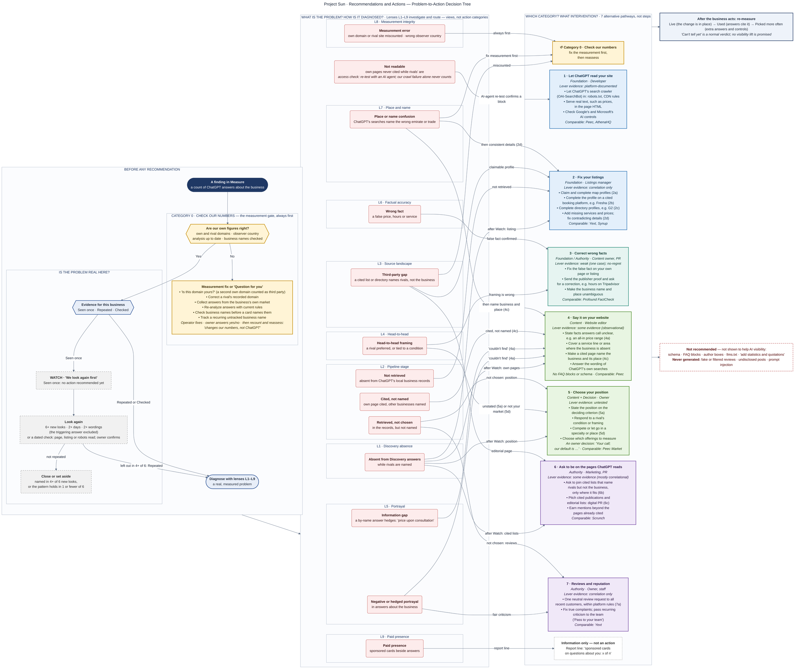

# Project Sun · Recommendations and Actions — Problem-to-Action Decision Tree

```mermaid
---
title: "Project Sun · Recommendations and Actions — Problem-to-Action Decision Tree"
config:
  theme: base
  fontFamily: Arial
  themeVariables:
    fontFamily: Arial
    fontSize: 15px
    lineColor: "#5b6b82"
    primaryTextColor: "#1f2a3d"
    clusterBkg: "#fbfcfe"
    clusterBorder: "#aab6c8"
    edgeLabelBackground: "#ffffff"
    titleColor: "#1f3864"
  flowchart:
    htmlLabels: true
    useMaxWidth: false
    curve: basis
    nodeSpacing: 26
    rankSpacing: 70
    padding: 16
    wrappingWidth: 520
---
flowchart LR

  subgraph ENTRY["BEFORE ANY RECOMMENDATION"]
    direction TB
    START(["<b>A finding in Measure</b><br>a count of ChatGPT answers about the business"]):::start

    subgraph GATE["CATEGORY 0 · CHECK OUR NUMBERS — the measurement gate, always first"]
      direction TB
      G0{{"<b>Are our own figures right?</b><br>own and rival domains · observer country<br>analysis up to date · business names checked"}}:::gate
      GF["<b>Measurement fix or 'Question for you'</b><br>• 'Is this domain yours?' (a second own domain counted as third party)<br>• Correct a rival's recorded domain<br>• Collect answers from the business's own market<br>• Re-analyze answers with current rules<br>• Check business names before a card names them<br>• Track a recurring untracked business name<br><i>Operator fixes · owner answers yes/no · then recount and reassess:<br>'changes our numbers, not ChatGPT'</i>"]:::gate
    end

    subgraph EVID["IS THE PROBLEM REAL HERE?"]
      direction TB
      E0{{"<b>Evidence for this business</b><br>Seen once · Repeated · Checked"}}:::evid
      W["<b>WATCH · 'We look again first'</b><br>Seen once: no action recommended yet"]:::watch
      WL["<b>Look again</b><br>6+ new looks · 2+ days · 2+ wordings<br>(the triggering answer excluded)<br>or a dated check: page, listing or robots read; owner confirms"]:::watch
      WC["<b>Close or set aside</b><br>named in 4+ of 6 new looks,<br>or the pattern holds in 1 or fewer of 6"]:::watch
    end
    GO(["<b>Diagnose with lenses L1–L9</b><br>a real, measured problem"]):::evid
    START --> G0
    G0 -- "No" --> GF
    G0 -- "Yes" --> E0
    E0 -- "Seen once" --> W
    W --> WL
    WL -- "not repeated" --> WC
    WL -- "left out in 4+ of 6: Repeated" --> GO
    E0 -- "Repeated or Checked" --> GO
  end

  subgraph DIAG["WHAT IS THE PROBLEM? HOW IS IT DIAGNOSED? · Lenses L1–L9 investigate and route — views, not action categories"]
    direction TB
    subgraph L8["L8 · Measurement integrity"]
      P12("<b>Measurement error</b><br>own domain or rival site miscounted · wrong observer country"):::problem
    end
    subgraph L7["L7 · Place and name"]
      P11("<b>Place or name confusion</b><br>ChatGPT's searches name the wrong emirate or trade"):::problem
    end
    PX("<b>Not readable</b><br>own pages never cited while rivals' are<br><i>access check: re-test with an AI agent; our crawl failure alone never counts</i>"):::problem
    subgraph L3["L3 · Source landscape"]
      P8("<b>Third-party gap</b><br>a cited list or directory names rivals, not the business"):::problem
    end
    subgraph L2["L2 · Pipeline stage"]
      P2("<b>Not retrieved</b><br>absent from ChatGPT's local business records"):::problem
      P3("<b>Retrieved, not chosen</b><br>in the records, but not named"):::problem
      P4("<b>Cited, not named</b><br>own page cited, other businesses named"):::problem
    end
    subgraph L6["L6 · Factual accuracy"]
      P7("<b>Wrong fact</b><br>a false price, hours or service"):::problem
    end
    subgraph L4["L4 · Head-to-head"]
      P9("<b>Head-to-head framing</b><br>a rival preferred, or tied to a condition"):::problem
    end
    subgraph L5["L5 · Portrayal"]
      P6("<b>Information gap</b><br>a by-name answer hedges: 'price upon consultation'"):::problem
      P10("<b>Negative or hedged portrayal</b><br>in answers about the business"):::problem
    end
    subgraph L1["L1 · Discovery absence"]
      P1("<b>Absent from Discovery answers</b><br>while rivals are named"):::problem
    end
    subgraph L9["L9 · Paid presence"]
      P13("<b>Paid presence</b><br>sponsored cards beside answers"):::problem
    end
  end

  subgraph ACT["WHICH CATEGORY? WHAT INTERVENTION? · 7 alternative pathways, not steps"]
    direction TB
    C0R["<b>↺ Category 0 · Check our numbers</b><br>fix the measurement first,<br>then reassess"]:::gate
    C1["<b>1 · Let ChatGPT read your site</b><br><i>Foundation · Developer</i><br><i>Lever evidence: platform-documented</i><br>• Let ChatGPT's search crawler<br>(OAI-SearchBot) in: robots.txt, CDN rules<br>• Serve real text, such as prices,<br>in the page HTML<br>• Check Google's and Microsoft's<br>AI controls<br><i>Comparable: Peec, AthenaHQ</i>"]:::found
    C2["<b>2 · Fix your listings</b><br><i>Foundation · Listings manager</i><br><i>Lever evidence: correlation only</i><br>• Claim and complete map profiles (2a)<br>• Complete the profile on a cited<br>booking platform, e.g. Fresha (2b)<br>• Complete directory profiles, e.g. G2 (2c)<br>• Add missing services and prices;<br>fix contradicting details (2d)<br><i>Comparable: Yext, Synup</i>"]:::found
    C3["<b>3 · Correct wrong facts</b><br><i>Foundation / Authority · Content owner, PR</i><br><i>Lever evidence: weak (one case); no-regret</i><br>• Fix the false fact on your own<br>page or listing<br>• Send the publisher proof and ask<br>for a correction, e.g. hours on Tripadvisor<br>• Make the business name and<br>place unambiguous<br><i>Comparable: Profound FactCheck</i>"]:::factc
    C4["<b>4 · Say it on your website</b><br><i>Content · Website editor</i><br><i>Lever evidence: some evidence (observational)</i><br>• State facts answers call unclear,<br>e.g. an all-in price range (4a)<br>• Cover a service line or area<br>where the business is absent<br>• Make a cited page name the<br>business and its place (4c)<br>• Answer the wording of<br>ChatGPT's own searches<br><i>No FAQ blocks or schema · Comparable: Peec</i>"]:::content
    C5["<b>5 · Choose your position</b><br><i>Content + Decision · Owner</i><br><i>Lever evidence: untested</i><br>• State the position on the<br>deciding criterion (5a)<br>• Respond to a rival's<br>condition or framing<br>• Compete or let go in a<br>specialty or place (5d)<br>• Choose which offerings to measure<br><i>An owner decision: 'Your call;<br>our default is …' · Comparable: Peec Market</i>"]:::content
    C6["<b>6 · Ask to be on the pages ChatGPT reads</b><br><i>Authority · Marketing, PR</i><br><i>Lever evidence: some evidence (mostly correlational)</i><br>• Ask to join cited lists that name<br>rivals but not the business,<br>only where it fits (6b)<br>• Pitch cited publications and<br>editorial lists: digital PR (6c)<br>• Earn mentions beyond the<br>pages already cited<br><i>Comparable: Scrunch</i>"]:::auth
    C7["<b>7 · Reviews and reputation</b><br><i>Authority · Owner, staff</i><br><i>Lever evidence: correlation only</i><br>• One neutral review request to all<br>recent customers, within platform rules (7a)<br>• Fix true complaints; pass recurring<br>criticism to the team<br>('Pass to your team')<br><i>Comparable: Yext</i>"]:::auth
    INFO["<b>Information only — not an action</b><br>Report line: 'sponsored cards<br>on questions about you: x of n'"]:::info
  end

  NEV["<b>Not recommended</b> — not shown to help AI visibility:<br>schema · FAQ blocks · author boxes · llms.txt · 'add statistics and quotations'<br><b>Never generated:</b> fake or filtered reviews · undisclosed posts · prompt injection"]:::never
  OUT["<b>After the business acts: re-measure</b><br>Live (the change is in place) → Used (answers cite it) → Picked more often (extra answers and controls)<br><i>'Can't tell yet' is a normal verdict; no visibility lift is promised</i>"]:::outcome


  ENTRY --> DIAG
  ENTRY ~~~ L8

  P12 -- "always first" --> C0R
  P11 -- "fix measurement first" --> C0R
  P11 -- "then consistent details (2d)" --> C2
  P11 -- "then name business and place (4c)" --> C4
  PX -- "AI-agent re-test confirms a block" --> C1
  P8 -- "miscounted" --> C0R
  P8 -- "claimable profile" --> C2
  P8 -- "editorial page" --> C6
  P2 -- "not retrieved" --> C2
  P3 -- "not chosen: reviews" --> C7
  P3 -- "not chosen: position" --> C5
  P4 -- "cited, not named (4c)" --> C4
  P7 -- "false fact confirmed" --> C3
  P9 -- "framing is wrong" --> C3
  P9 -- "unstated (5a) or not your market (5d)" --> C5
  P6 -- "'couldn't find' (4a)" --> C4
  P10 -- "'couldn't find' (4a)" --> C4
  P10 -- "fair criticism" --> C7
  P1 -- "after Watch: listing" --> C2
  P1 -- "after Watch: own pages" --> C4
  P1 -- "after Watch: position" --> C5
  P1 -- "after Watch: cited lists" --> C6
  P13 -- "report line" --> INFO

  ACT --> OUT
  ACT --> NEV

  classDef start fill:#1f3864,stroke:#1f3864,color:#ffffff
  classDef gate fill:#fff4d6,stroke:#c48a00,stroke-width:2px,color:#3d2c00
  classDef evid fill:#e8eef8,stroke:#2e5597,stroke-width:2px,color:#1f2a3d
  classDef watch fill:#f1f1f1,stroke:#7f7f7f,stroke-dasharray:5 4,color:#2b2b2b
  classDef problem fill:#fdecec,stroke:#c0504d,color:#3b1414
  classDef found fill:#e3effb,stroke:#2e75b6,stroke-width:2px,color:#10304f
  classDef factc fill:#e6f4f1,stroke:#2a8c7a,stroke-width:2px,color:#0f3a32
  classDef content fill:#e8f5e2,stroke:#4c8c2b,stroke-width:2px,color:#1d3a10
  classDef auth fill:#f0e8f8,stroke:#7a4fa8,stroke-width:2px,color:#2c1846
  classDef info fill:#ffffff,stroke:#7f7f7f,stroke-dasharray:3 3,color:#2b2b2b
  classDef never fill:#ffffff,stroke:#a61c1c,stroke-dasharray:6 3,color:#5a0e0e
  classDef outcome fill:#eef3fa,stroke:#1f3864,stroke-width:2px,color:#1f2a3d
```
